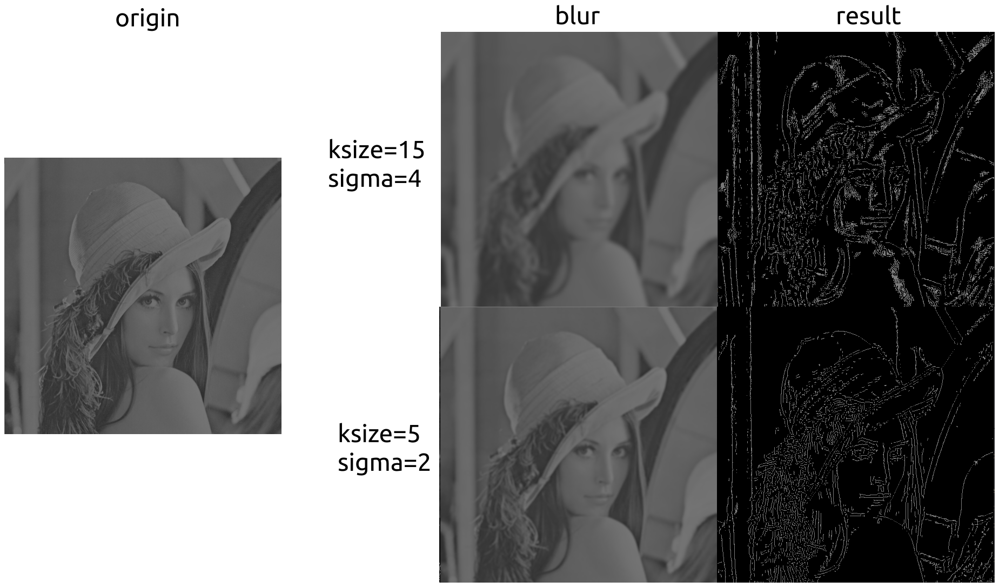
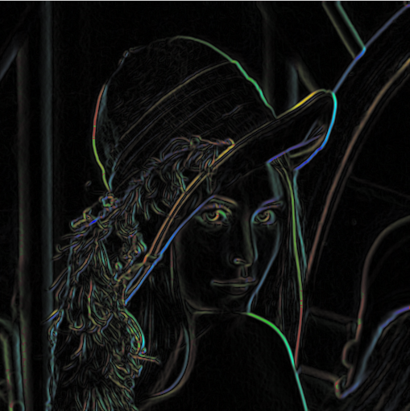
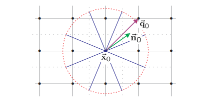
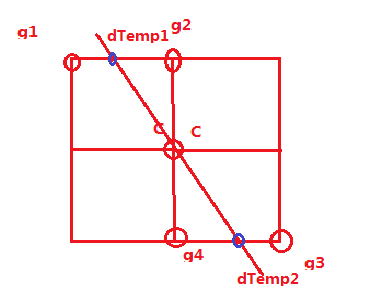
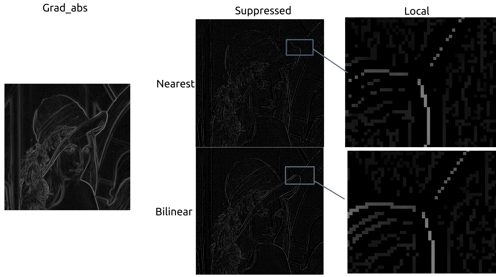
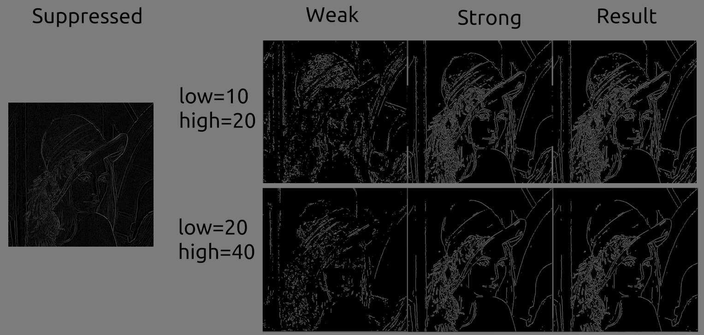
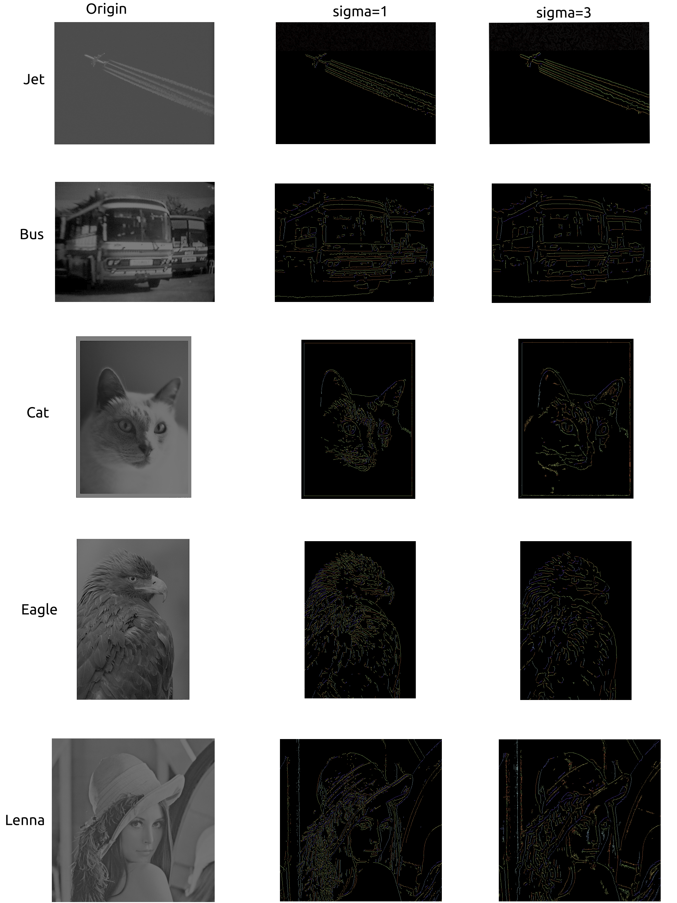
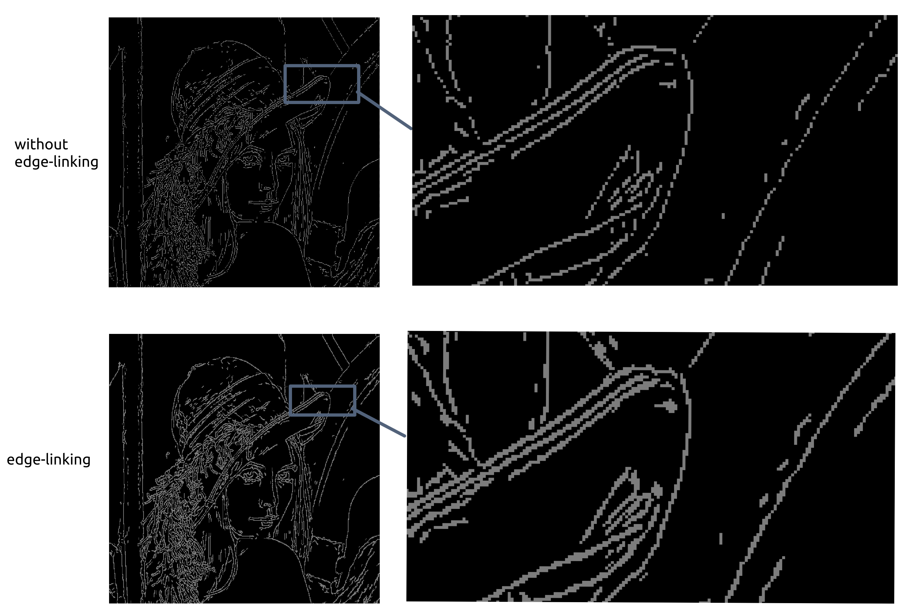
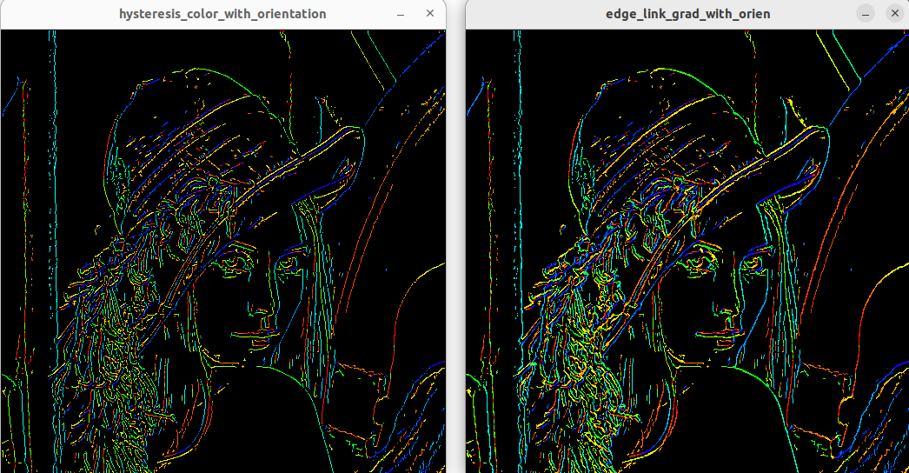

# Canny

2012522 郭坤昌 计算机科学与技术

[TOC]

## 实验名称

Canny边缘检测。

## 实验原理简述

Canny算法[^1]是一种多阶段的边缘检测算法，对于满足高斯分布的噪声影响的阶跃边缘检测，提出了边缘检测的一些指标，包括找全（尽可能找到所有边缘）、找准（找到的点应尽可能位于边缘的中心）、稳定（一条边只被标记一次，且应尽可能规避因噪声而错误标记的“假边”）。Canny证明了高斯函数的一阶导数能够近似地取得较好的定位和去噪效果。

Canny算法包括如下阶段：

1. 去噪滤波；
2. 计算梯度，包括大小和方向；
3. 沿梯度方向的非极大值抑制；
4. 双阈值滤波，分别得到通过高阈值的强响应像素点集合，以及处于双阈值间的弱响应像素点集合；
5. 滞后跟踪，从强响应像素点出发，连接周围可能的弱响应像素点。

[^1]: J. Canny, "A Computational Approach to Edge Detection," in IEEE Transactions on Pattern Analysis and Machine Intelligence, vol. PAMI-8, no. 6, pp. 679-698, Nov. 1986, doi: 10.1109/TPAMI.1986.4767851.

## 实验设计

首先基于Canny算法的主要步骤进行复现，再对其中参数进行调整，分析结果；接下来进行连续性改进实验；最后使用机器学习进行对比分析。代码详见[GitHub仓库](https://github.com/Yuer-yuan/CV/tree/main/lab2-canny-edge-detection)。

## 实验过程与结果分析

### Canny算法

#### 去噪滤波

使用高斯滤波减少读入灰度图像的噪声。

滤波结果直接影响后续过程，需要在“找全”与“找准”间进行权衡，如下图1所示。



<div style="text-align: center"><font size=2>图1 不同高斯滤波参数对结果的影响。平滑过多，覆盖广泛，却难以找准边缘；平滑不足，边缘准确，却噪声影响较多</font></div>

#### 计算梯度

使用Sobel算子分别计算滤波后图像在水平和竖直方向上的梯度，使用如下公式计算每个像素点$(i,j)$的梯度大小$grad(i,j)$和方向$orientation(i,j)$：
$$
grad(i,j) = \sqrt{grad_x^2(i,j)+grad_y^2(x,y)} \\
orientation(i,j)=atan2(grad_y(i,j)/grad_x(i,j))
$$

处理结果如图2所示。



<div style="text-align: center"><font size=2>图2 Sobel算子大小为3时的梯度及对应方向示意。方向使用0~180度范围内的对应色盘颜色进行表示</font></div>

#### 非极大值抑制

根本思想是在梯度方向上判断像素点是否为“周围”梯度最大值点，具体方法有多种，如“就近法”与线性插值法是实践中常用且快速的方法。

就近法将梯度划分为4个区域，根据中心像素点梯度方向寻找近似梯度方向上的周围点，若中心店梯度值最大，则为极大值点，否则其不能作为边缘，如图3所示。



<div style="text-align: center"><font size=2>图3 就近划分找梯度方向上就近点（图源<a href="https://www.cs.toronto.edu/~jepson/csc420/notes/edgeDetection.pdf">edgeDetection.dvi</a>）</font></div>

图示梯度方向度数处于$[22.5, 67.5)$之间，则找到“周围”梯度值分别为

```c++
grad1 = img_grad_norm.at<uint8_t>(i - 1, j + 1);
grad2 = img_grad_norm.at<uint8_t>(i + 1, j - 1);
```

若不满足中心像素点为极大值点，则抑制它，不能作为边缘像素

```c++
grad = img_grad_norm.at<uint8_t>(i, j);
if (grad >= grad1 && grad >= grad2) img_suppressed.at<uint8_t>(i, j) = grad;
else img_suppressed.at<uint8_t>(i, j) = 0;
```

对于双线性插值，则直接计算梯度延长线与对应边的交点的梯度值，再做比较，如图4所示。



<div style="text-align: center"><font size=2>图4 线性插值找梯度上就近点（图源<a href="https://blog.csdn.net/kezunhai/article/details/11620357">Canny算子中的非极大值抑制（Non-Maximum Suppression）分析</a>）</font></div>

使用插值计算`dTemp1`与`dTemp2`，图示情况中心点的竖直方向梯度大小大于水平方向梯度大小，则计算方法如下，之后与就近法相似，进行比较。

```c++
weight = grad_x / grad_y;
dTemp1 = weight * img_grad_norm.at<uint8_t>(i - 1, j - 1) + (1 - weight) * img_grad_norm.at<uint8_t>(i - 1, j);
dTemp2 = weight * img_grad_norm.at<uint8_t>(i + 1, j + 1) + (1 - weight) * img_grad_norm.at<uint8_t>(i + 1, j);
```

处理结果如图5所示。观察到双线性插值结果在连续性和细节保存程度上都更好，猜想是由于其更好地利用了角度信息。



<div style="text-align: center"><font size=2>图5 非极大值抑制（就近方法与双线性插值方法对比）结果></font></div>

#### 双阈值滤波

使用双阈值对非极大抑制结果进行滤波，响应高于高阈值的像素点标记为强响应点，组成边缘，处于双阈值间的像素点标记为弱响应点，低于低阈值的像素点不可能作为边缘。

```c++
if (grad >= high_threshold) img_strong.at<uint8_t>(i, j) = fill;
else if (grad >= low_threshold) img_weak.at<uint8_t>(i, j) = fill;
```

#### 滞后跟踪

对于每一个弱响应点，若其“周围”——8像素邻域存在强响应点，则其组成边缘。

```c++
weak_pt = img_weak.at<uint8_t>(i, j);
if (weak_pt == 0) continue;
if (img_strong.at<uint8_t>(i - 1, j - 1) | img_strong.at<uint8_t>(i - 1, j) | img_strong.at<uint8_t>(i - 1, j + 1) |
    img_strong.at<uint8_t>(i, j - 1) | img_strong.at<uint8_t>(i, j + 1) |
    img_strong.at<uint8_t>(i + 1, j - 1) | img_strong.at<uint8_t>(i + 1, j) | img_strong.at<uint8_t>(i + 1, j + 1)) {
        img_hysteresis.at<uint8_t>(i, j) = weak_pt;
}
```

双阈值滤波及最终滞后跟踪的结果如图6所示。可以看到不同阈值组合对像素点的保存程度也不同，最终结果主要取决于高阈值的范围，高低阈值之间的弱响应点对结果影响不大，对局部的连续性有一定作用。



<div style="text-align: center"><font size=2>图6 不同双阈值取值下滤波结果及滞后跟踪结果</font></div>



<div style="text-align: center"><font size=2>图7 不同sigma取值下Canny边缘检测结果对比（图像根据像素点梯度方向着色）</font></div>

### 边缘预测

观察canny算子处理结果，对于局部的阶跃边缘有很好的识别准确性，但曲线连续性不够好，“颗粒感”较重。考虑沿着边缘点的切向方向，将边缘点的梯度“传递”到切向方向的周围点，最终计算各点“投票”总和，若超过设定阈值，则预测其为边缘。

具体步骤为：

1. 梯度传递。对滞后跟踪结果的像素点，与“就近法”类似，找到梯度切向上，非强响应像素的“相邻点”，将梯度值传递给它。

2. 计算投票。对所有非边缘点，计算“投票”的向量和（若该点为弱响应像素点，其自身还需要投票），并由投票数取平均，作为该点被传递得到的梯度。
3. 合并边缘。对于所有非边缘点，若其被传递梯度大小大于设定阈值，则成为边缘，加入最终结果。

实验结果如图8所示。观察局部，显然该边缘预测方法相当于沿边缘像素点切向上进行“膨胀”。由于同一边缘的相邻像素点（非角点）的梯度变化不大，因此沿着切向传递能够有效补充被“切断”的边缘像素点。



<div style="text-align: center"><font size=2>图8 基本方法与使用边缘预测方法的边缘连续性对比，边缘预测能改善局部连续性</font></div>

该方法只是一个简单思路，还有很多细节可以改进。如一个像素点投票力度应该小于多个像素点的投票，这样可以有效减少边缘的膨胀；梯度传递可以使用插值计算更为精确合理的数值……

关于该方法的正确性，尝试从投票所得点的梯度值进行说明，如图9，增补的像素点方向，仍然与周围原本像素点方向保持基本一致（以梯度方向上色，增补的像素点与原本像素点颜色基本一致）。



<div style="text-align: center"><font size=2>图9 基本方法与使用边缘预测方法的梯度方向展示，因预测而增补的像素点仍保持与周围像素点方向基本一致</font></div>

而根本上，Canny边缘检测连续性不够好的原因，是过分关注局部，缺少关键的语义信息。