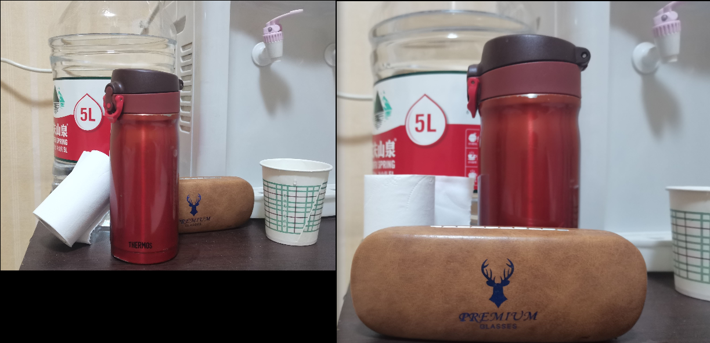
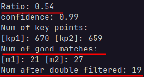

# Feature Matching

2012522 郭坤昌 计算机科学与技术

[TOC]
## 实验名称 

特征匹配。

## 实验设计

### Ratio-test

获取关键点，计算局部特征描述子并匹配。为每个关键点保留 2 个最佳匹配（L2距离最短即最佳匹配）。 通过ratio-test检查这两个距离是否足够不同。如果不是，则该关键点将被删除，不会用于进一步的计算[^1]。
[^1]:Lowe, D. G. (2004). Distinctive Image Features from Scale-Invariant Keypoints. Int. J. Comput. Vision, 60, 91--110. doi: 10.1023/B:VISI.0000029664.99615.94

### 改善SIFT匹配的进一步思路

Liu[^2]等人从内窥镜图象拼接的角度，基于SIFT特征，提出了更鲁棒的离群值过滤方案：
[^2]:Liu Y, Tian J, Hu R, Yang B, Liu S, Yin L and Zheng W (2022) Improved Feature Point Pair Purification Algorithm Based on SIFT During Endoscope Image Stitching. *Front. Neurorobot.* 16:840594. doi: 10.3389/fnbot.2022.840594

1. 双向邻近距离比值筛选得到粗略的特征匹配
2. RANSAC减少错匹配

## 实验过程与结果分析

### 实验数据

选用摆放不同物品的两张照片，如图1所示。图中物品在规模、透视角度、旋转、相对位置均有不同变化。



<div style="text-align: center"><font size=2>图1 用于特征匹配的两张图片</font></div>

### Ratio-test

首先计算灰度图的特征点及对应特征描述子，并为每个特征点匹配最近的两个特征点。

```c++
void compute_key_points_and_descriptors(
    const cv::Mat &img_gray, 
    std::vector<cv::KeyPoint> &key_points, 
    cv::Mat &descriptors
) {
    cv::Ptr<cv::SIFT> sift = cv::SIFT::create();
    sift->detect(img_gray, key_points);
    sift->compute(img_gray, key_points, descriptors);
}

void match_key_points(
    const cv::Mat &descriptors_1, 
    const cv::Mat &descriptors_2, 
    std::vector<std::vector<cv::DMatch>> &nearest_matches
) {
    cv::FlannBasedMatcher matcher;
    matcher.knnMatch(descriptors_1, descriptors_2, nearest_matches, 2);
}
```

根据每个特征点到最近两个特征点的距离比值进行筛选。

```c++
void filter_by_nearest_distance_ratio(
    const std::vector<std::vector<cv::DMatch>> &nearest_matches, 
    const double &ratio, 
    std::vector<cv::DMatch> &matches_filtered
) {
    for (int i = 0; i < nearest_matches.size(); i++) {
        if (nearest_matches[i][0].distance < ratio * nearest_matches[i][1].distance) {
            matches_filtered.push_back(nearest_matches[i][0]);
        }
    }
}
```

如图2，ratio-test过滤了很多误匹配的特征点。


<div style="text-align: center"><font size=2>图2 ratio-test前后特征点匹配情况对比（ratio为0.6）</font></div>

### 离群值过滤

参考[^2]中离群值过滤思路，首先使用双向ratio-test取交集的思路，获取稳定匹配的特征点。

```c++
void double_filter(
		const std::vector<cv::DMatch> &matches_1, 
		const std::vector<cv::DMatch> &matches_2, 
		std::vector<cv::DMatch> &matches_double_filtered
		) {
	std::set<std::pair<int, int>> double_match_pairs;
	for (auto match : matches_2) {
		if (double_match_pairs.find(std::make_pair(match.queryIdx, match.trainIdx)) == double_match_pairs.end()) {
			double_match_pairs.insert(std::make_pair(match.queryIdx, match.trainIdx));			
		}
	}
	for (auto match : matches_1) {
		if (double_match_pairs.find(std::make_pair(match.trainIdx, match.queryIdx)) != double_match_pairs.end()) {
			matches_double_filtered.push_back(match);
		}
	}
}
```

观察输出结果，有部分非交集的匹配被过滤。



再通过设定RANSAC范围阈值及置信度，使用单应性变换作为约束，提高特征匹配的鲁棒性。

```c++
void ransac(
		const std::vector<cv::KeyPoint> &key_points_1, 
		const std::vector<cv::KeyPoint> &key_points_2, 
		const std::vector<cv::DMatch> &matches_double_filtered, 
		const double ransac_reproj_thresh,
		const double confidence,
		std::vector<cv::DMatch> &matches_ransac_filtered
		) {
	std::vector<cv::Point2f> points_1, points_2;
	for (auto match : matches_double_filtered) {
		int query_idx = match.queryIdx, train_idx = match.trainIdx;
		points_1.push_back(cv::Point2f(key_points_1[query_idx].pt.x, key_points_1[query_idx].pt.y));
		points_2.push_back(cv::Point2f(key_points_2[train_idx].pt.x, key_points_2[train_idx].pt.y));
	}
	std::vector<uchar> inliers(points_1.size(), 0);
	cv::Mat fundamental_mat = cv::findFundamentalMat(
        cv::Mat(points_1), 
        cv::Mat(points_2), 
        cv::FM_RANSAC, 
        ransac_reproj_thresh, 
        confidence, 
        inliers
    );
	int tmp_idx = 0;
	for (auto inlier : inliers) {
		if (inlier) {
			matches_ransac_filtered.push_back(cv::DMatch(matches_double_filtered[tmp_idx].queryIdx, matches_double_filtered[tmp_idx].trainIdx, 0));
		}
		tmp_idx++;
	}	
}
```

双向ratio-test及RANSAC后，特征匹配的鲁棒性有了显著提升，如图3所示。


<div style="text-align: center"><font size=2>图3 未进行离群值过滤与离群值过滤后的对比（ratio为0.7）</font></div>

### 结果分析

1. ratio-test能显著提升匹配鲁棒性，随着阈值提升，误匹配情况越发增多。
2. 基于RANSAC的离群值过滤应当仅适用于仅仅有仿射变换的情况，对于实验采用的物品相对位置动态变化的一对照片，其实是不能符合全局的单应性变换约束的，但仍然有进一步提高匹配鲁棒性的效果。因此对于动态变换的特征匹配，应当选用其他匹配方法，如基于特征点局部性的GMS[^3]，或者基于局部仿射变换[^4]的方法。

[^3]:J. Bian, W. -Y. Lin, Y. Matsushita, S. -K. Yeung, T. -D. Nguyen and M. -M. Cheng, "GMS: Grid-Based Motion Statistics for Fast, Ultra-Robust Feature Correspondence," *2017 IEEE Conference on Computer Vision and Pattern Recognition (CVPR)*, Honolulu, HI, USA, 2017, pp. 2828-2837, doi: 10.1109/CVPR.2017.302.
[^4]: Cavalli, L., Larsson, V., Oswald, M. R., Sattler, T., & Pollefeys, M. (2020). Adalam: Revisiting handcrafted outlier detection. *arXiv preprint arXiv:2006.04250*.Chicago

3. 在本机情况下，特征匹配效率其实不高，匹配速率在5帧左右，对于实时性较好的应用，应当采用速率更快的特征描述子及匹配方法。
