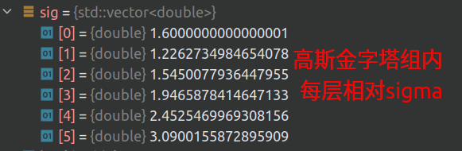
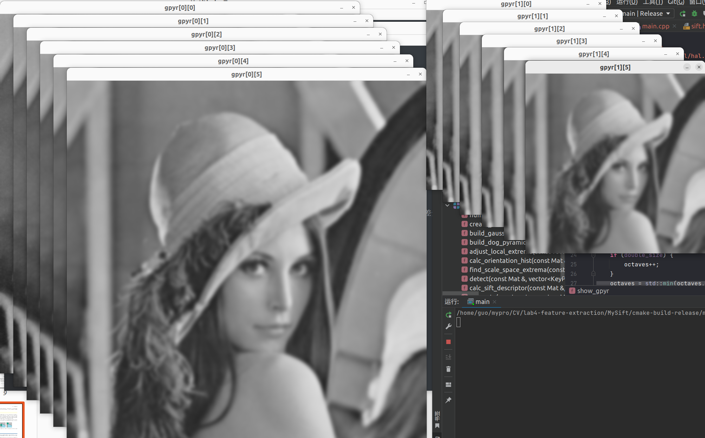
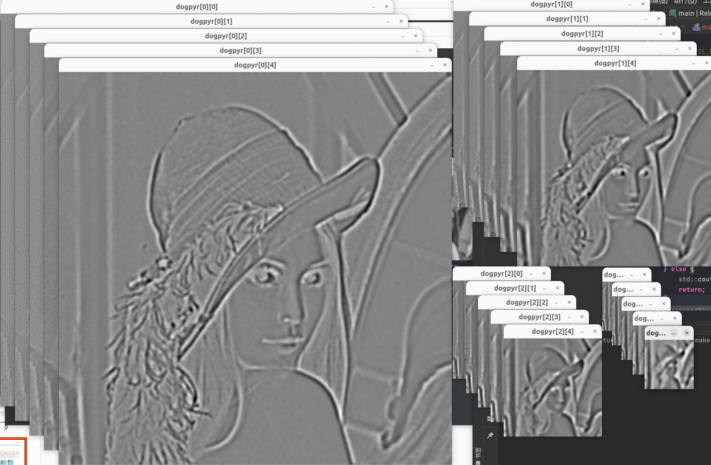
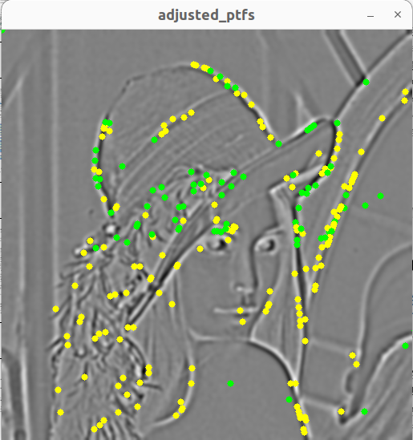
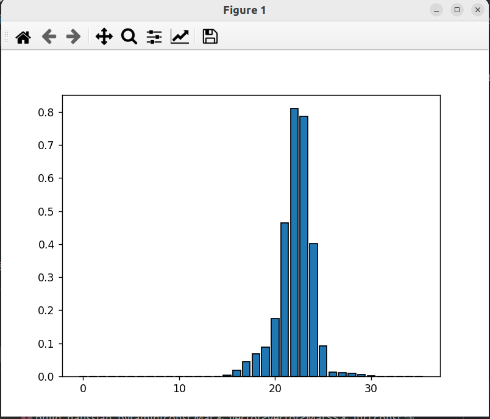
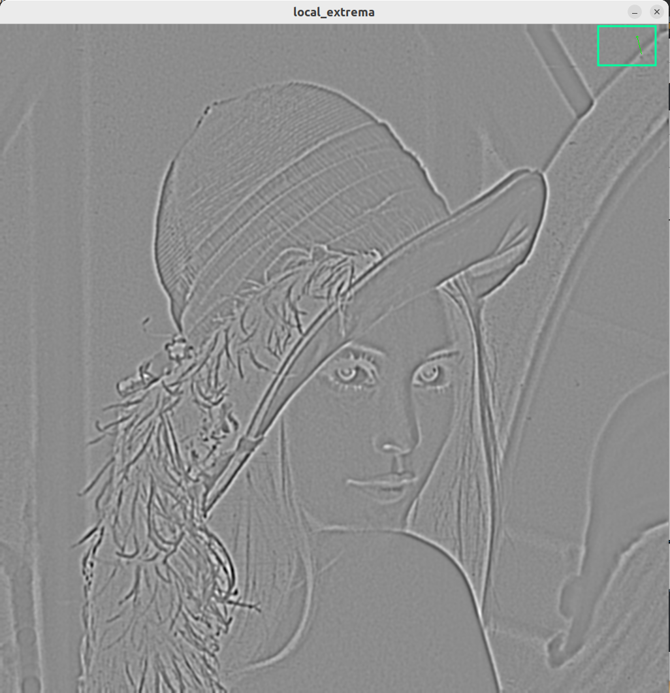
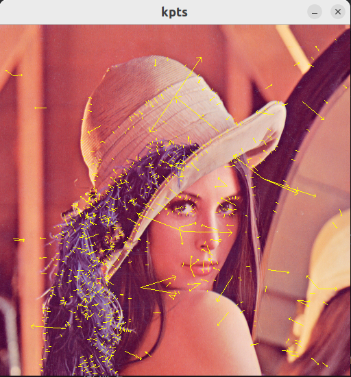
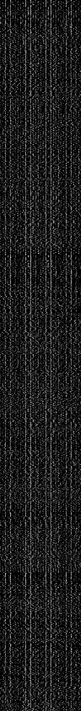
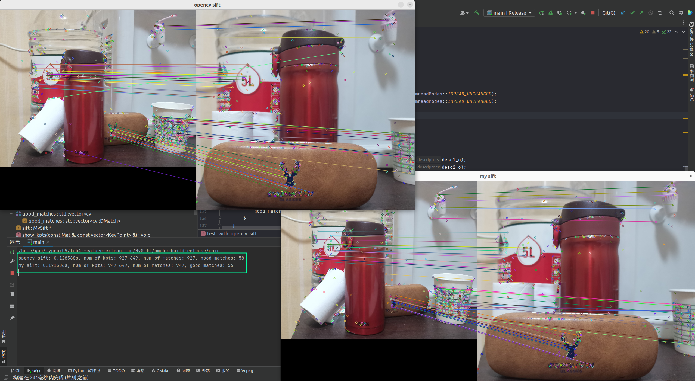

# Feature Extraction

2012522 郭坤昌 计算机科学与技术

[TOC]

## 实验名称

特征提取。

## 实验设计

复现SIFT。

## 实验过程与结果

### 尺度空间的建立

高斯核是将不同尺度图像关联起来的核心，构建尺度空间即构建不同尺度的高斯金字塔和高斯差分金字塔。

### 尺度空间极值点

从2 * 9 + 8个点中找到最大响应点后，进行进一步调整：三维插值找到真正极值点的位置和尺度，并重新计算对比度和边缘响应，进行筛选。

如下图所示，为某一尺度的高斯差分图像，黄色点表示未被筛选过的极值点，绿色点表示筛选后的极值点。

接下来计算极值点的主方向，由所在对应尺度的高斯模糊图像周围像素梯度的高斯加权统计得到。

### 特征描述子

将关键点及领域旋转到新的左边，统计领域（共16个区域）中像素在8个方向加权的直方图，因此特征为128维。

### 结果对比

参照OpenCV实现，基本效果一致。在图像规模较大时，性能比原实现要快很多。（2883 * 2385）

