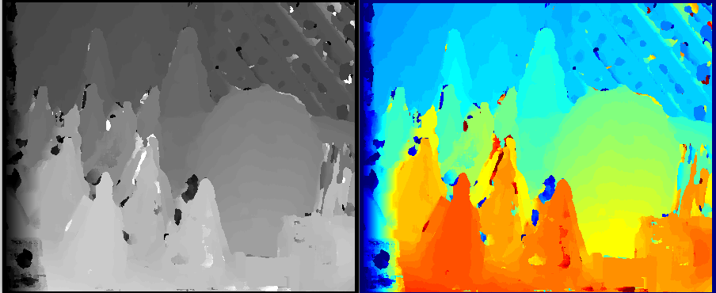
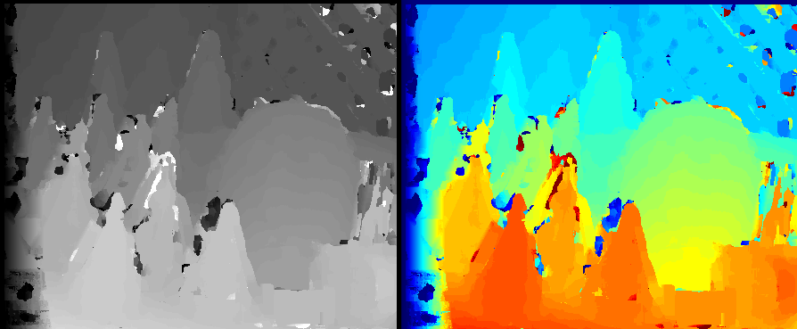
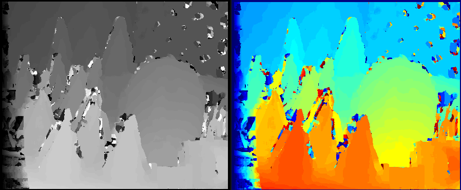
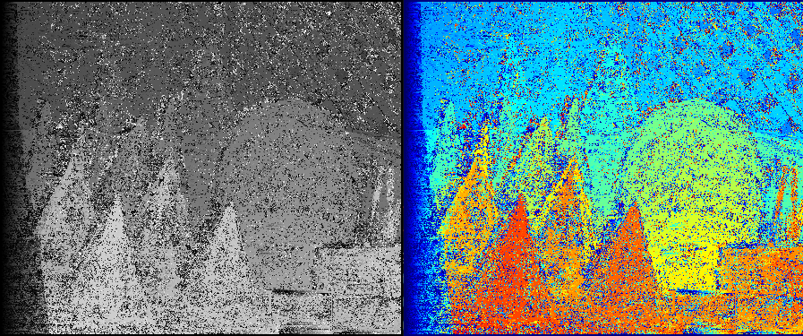
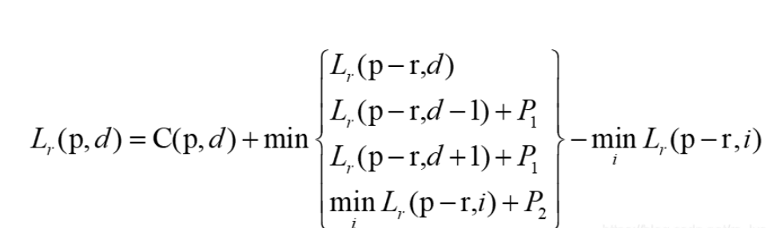
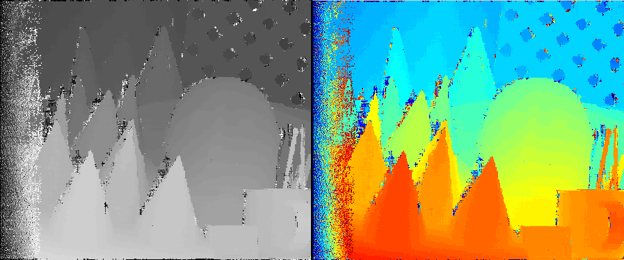
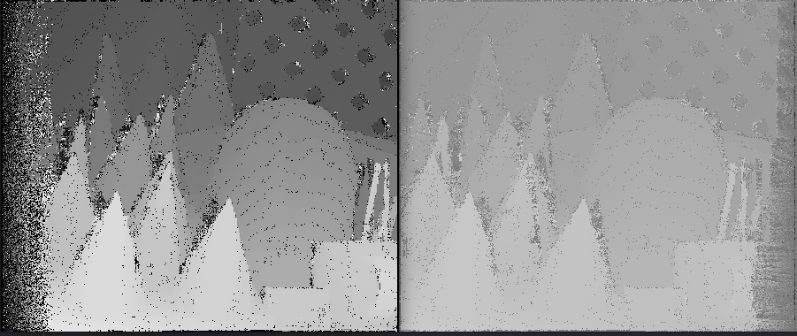
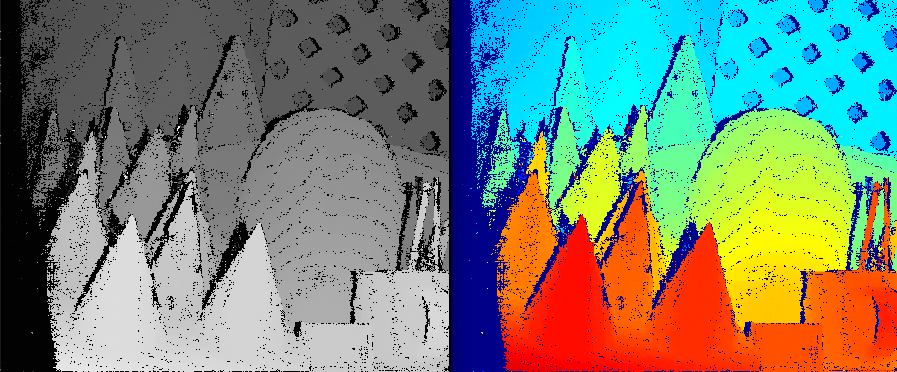
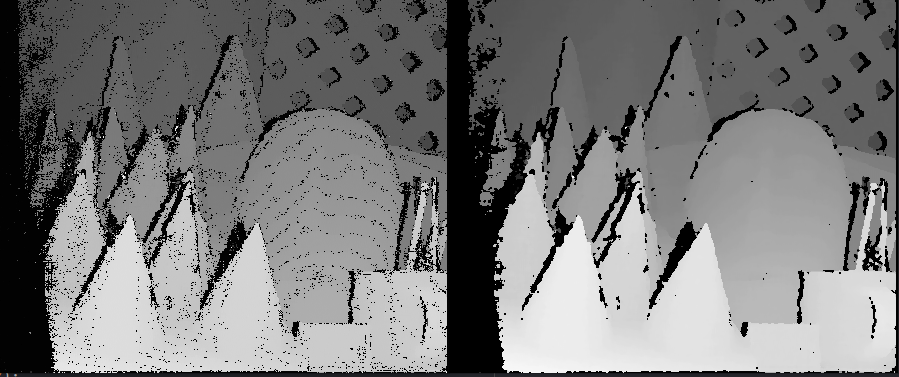
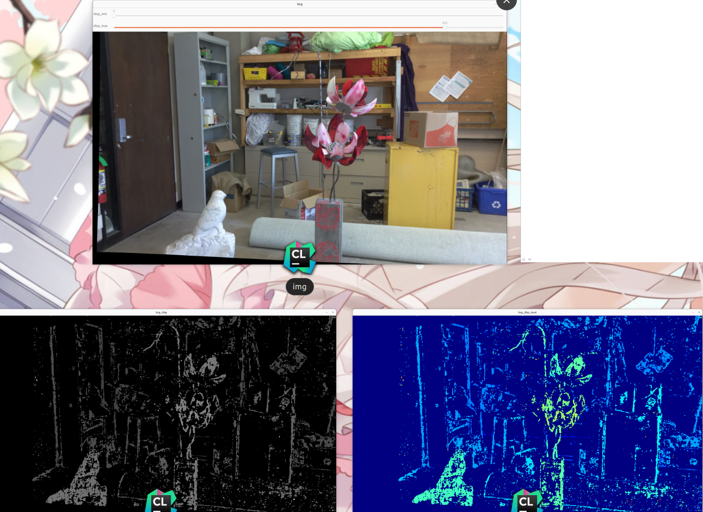

# Lab5 Depth Estimation
郭坤昌 2012522 计算机科学与技术

[TOC]

## 实验原理

立体视觉中的深度，与视差成反比。本实验依据立体视觉匹配的局部和半全局算法进行视差计算。为了提高这类算法的效率，通常要求极线与匹配的像素点在同一水平线上，因此还需要进行图像矫正。对于给定双目相机参数（基线长度、焦距长度）的情况，可以在计算视差的基础上进行深度估计。

(这里校准和深度计算没有实现，仅实现了视差计算)

## 实验过程与结果

###  基于局部相关的算法

SAD

SDD

NC

### 基于半全局相关的算法（Semi-global Matching）

#### 使用census变换近似MI相关

采用窗口大小为$5 \times 5$，视差范围为$[0, 63]$，在数据集`cones`上的结果：

### 特征聚合

使用动态规划使全局代价最小化。除了census匹配带来的代价，增加了两个惩罚项，分别对应视差为1像素、大于1像素的情况，用以适应斜面、曲面，以及前后景交替的情况。像素p沿着某条路径r的路径代价计算方法：

4方向聚合后的结果：

### 左右视差矫正（L-R check）

使用左图来估计右图的视差，根据对应像素点的视差之差判断是否超过阈值，若超过则为误匹配或遮挡的情况。

### 后处理——中值滤波

对于较大图像，感知能力减弱

## 参考文献与资料:
1. https://towardsdatascience.com/depth-estimation-1-basics-and-intuition-86f2c9538cd1
2. https://cmsc733.github.io/2022/proj/p3/
3. https://vivekseth.com/computer-vision-matrix-differences/ 
4. https://github.com/savnani5/Depth-Estimation-using-Stereovision/blob/main/depth.py
5. https://github.com/bharadwaj-chukkala/Stereo-Vision-to-estimate-depth-in-an-image/blob/master/stereo_vision.py
6. https://github.com/h-gokul/StereoDepthEstimation/blob/master/Code/misc/utils.py
7. https://www.cs.cmu.edu/~16385/s17/Slides/13.2_Stereo_Matching.pdf
8. https://www.cs.cmu.edu/~16385/s17/Slides/13.1_Stereo_Rectification.pdf
9. https://github.com/davechristian/Simple-SSD-Stereo/blob/main/stereomatch_SSD.py
10. https://towardsdatascience.com/a-comprehensive-tutorial-on-stereo-geometry-and-stereo-rectification-with-python-7f368b09924a
11. https://www.andreasjakl.com/easily-create-depth-maps-with-smartphone-ar-part-1/
12. http://www.cad.zju.edu.cn/home/gfzhang/training/stereo/stereo.html
13. https://learnopencv.com/applycolormap-for-pseudocoloring-in-opencv-c-python/
